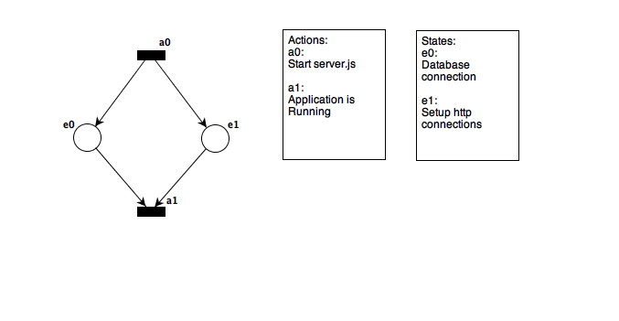
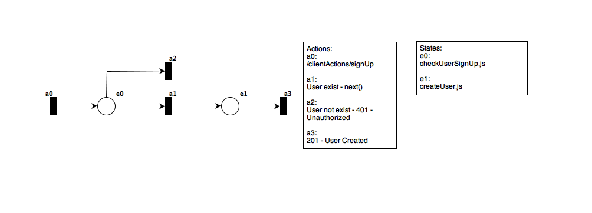
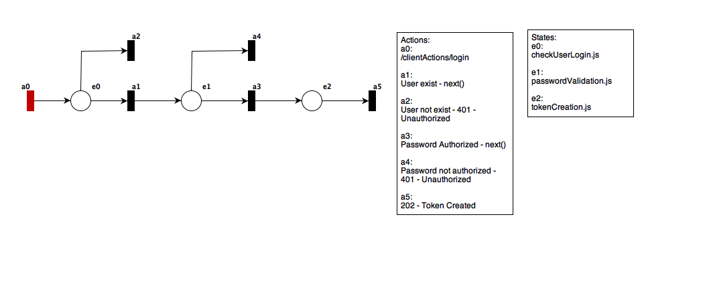
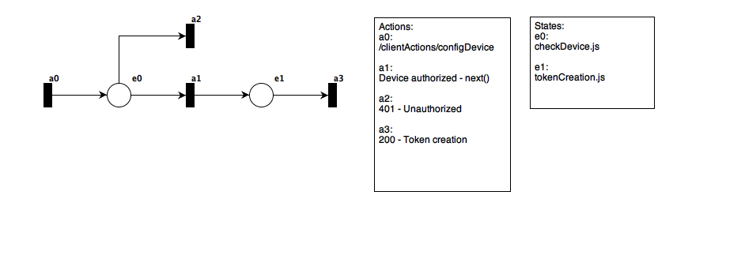
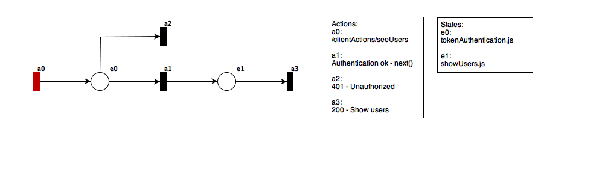
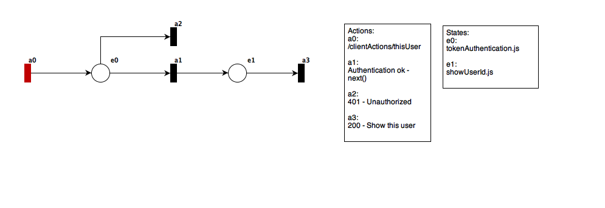
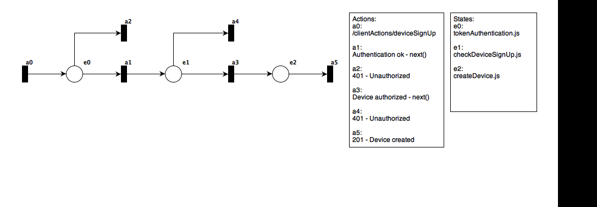

# Connecting the World Project
This project uses the Petri Net in your system modeling.

This is the server that will connect all the hardware and manage them.

# Actions
The concept of actions is asynchrounous process.

# States
The concept of state is synchronous process.

# Transitions
The concept of transitions is variable atributes, callbacks, functions, methods or third party requests.

# System Modeling 
This files to be open needs the Tapaal Software.

# Server Modeling

# Application Modeling

## signUp
POST https://connectingworldproject.herokuapp.com/clientActions/signUp  

### Request  
body  
x-www-form-urlencoded  
<code>
    {
        name: String,
        username: String,
        password: String
    }
</code>

### Response
<code>
    {
        status: int,
        message: String
    }
</code>

## login
POST https://connectingworldproject.herokuapp.com/clientActions/login  

### Request  
body  
x-www-form-urlencoded  
<code>
    {
        username: String,
        password: String
    }
</code>

### Response
<code>
    {
        status: int,
        message: String,
        token: String
    }
</code>

## configDevice
POST https://connectingworldproject.herokuapp.com/clientActions/configDevice  

### Request  
body  
x-www-form-urlencoded  
<code>
    {
        deviceCode: String
    }
</code>

### Response
<code>
    {
        status: int,
        message: String,
        token: String
    }
</code>

## seeUsers
GET https://connectingworldproject.herokuapp.com/clientActions/seeUsers  

### Request  
header  
<code>
    {
        token: String
    }
</code>

### Response
<code>
    {
        status: int,
        users: [Object]
    }
</code>

## thisUser
GET https://connectingworldproject.herokuapp.com/clientActions/thisUser  

### Request  
header  
<code>
    {
        token: String
    }
</code>

### Response
<code>
    {
        status: int,
        message: String,
        token: String
    }
</code>

## deviceSignUp
POST https://connectingworldproject.herokuapp.com/clientActions/deviceSignUp  

### Request  
header  
<code>
    {
        token: String
    }
</code>
body  
x-www-form-urlencoded  
<code>
    {
        deviceName: String,
        deviceCode: String,
        deviceVersion: String,
        deviceType: String
    }
</code>

### Response
<code>
    {
        status: int,
        message: String,
        token: String
    }
</code>

